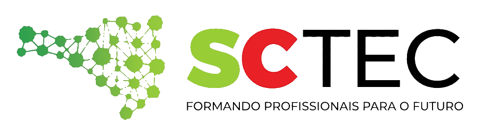

<p align="center">
  
</p>

# 🚀 ChurnIA

O Churn de margem é baseado no DRE (Demonstrativo de Resultado do Exercício), ferramenta contábil que registra fatos já ocorridos. A contabilidade, por essência, olha para o passado, mas o projeto busca dar um novo uso a esse instrumento: transformar dados históricos em previsões futuras.

O objetivo é analisar e prever o Churn de Margem no período de julho a dezembro de 2026, tornando o DRE uma ferramenta estratégica para antecipar cenários e apoiar decisões.

## 📌 Sobre o projeto

O ChurnIA é uma solução em Python para:

- carregar e limpar dados financeiros (DRE);
- realizar análise exploratória de dados;
- criar variáveis de negócio, como margem operacional e churn;
- treinar modelos de machine learning;
- gerar previsões futuras com base nos dados históricos.

## ✨ O que o projeto faz

- Processa arquivos CSV com dados financeiros (DRE).
- Gera gráficos e análises exploratórias.
- Cria datasets limpos e prontos para modelagem.
- Treina modelos com técnicas como regressão linear e regressão logística.
- Exporta resultados e previsões para pastas organizadas no projeto.

## 📁 Estrutura de pastas

```text
SCTec-ChurnIA/
├── ChurnIA.py                 # ponto de entrada do projeto
├── README.md                  # documentação do projeto
├── requirements.txt           # arquivo com as bibliotecas usadas 
├── .gitignore                 # arquivos e pastas que não devem subir para o github 
├── LICENSE                    # arquivo de licença
├── DadosBrutos/               # arquivos brutos importados
├── data/
│   ├── raw/                   # dados brutos
│   ├── processed/             # dados limpos
│   └── final/                 # dados prontos
├── models/
│   └── v1/                    # modelos treinados e métricas
├── img/
    ├──logo_sctec.png          # logotipo sctec readme
│   └──logo_sctecr.png         # logotipo sctec relatório
├── outputs/
│   └── figures/               # gráficos gerados
└── src/
    ├── config.py              # script para criação de pastas
    ├── data.py                # leitura e preparação dos dados (CSV)
    ├── install.py             # instalação das dependências
    ├── report.py              # geração do relatório de projeção
    └── pipeline.py            # fluxo completo de treino e previsão de ML
```

## ▶️ Como usar

### 1. Treinar o modelo

```bash
python ChurnIA.py --treinar
```

Esse comando:

- cria as pastas necessárias;
- instala as bibliotecas caso ainda não estejam presentes, automaticamente;
- executa o pipeline de treinamento.

### 2. Gerar previsões

```bash
python ChurnIA.py --prever
```

Esse comando executa o fluxo de previsão com base no modelo já treinado e deixa 4 cenários montados para analise:
1. Sem aumento e mantendo as médias
2. Aumento de receita e custos 10%
3. Aumento somente de custos 20%
4. Aumento das despesas 50%

## 📦 Arquivos e resultados gerados

Após a execução, o projeto gera:

- dados tratados em [data/processed](data/processed)
- datasets finais em [data/final](data/final)
- gráficos em [outputs/figures](outputs/figures)
- modelos e métricas em [models/v1](models/v1)

## 🛠️ Ferramentas utilizadas

- Git / GitHub
- Copilot
- Gemini
- aistudio.google.com
- VSCode **v_1.129.0**
- LibreOffice Calc **7.1.4.2 (x64)**
- Windows 10 x64 **v_10.0.19045**

## 💡 Observações

- O projeto usa um fluxo simples baseado em scripts Python e pode ser expandido para incluir novos modelos ou métricas.
- Foram adotados modelos de ML leves o suficiente para rodar em hardwares legados e com pouca memória.
- A estrutura de pastas é criada automaticamente ao executar os comandos de treino ou previsão.

## 🎥 Demonstração

https://drive.google.com/drive/.......

## 🧾 Conclusão

O resultado deste projeto é um protótipo prático que une **contabilidade, inteligência artificial e visão de negócio**, permitindo que gestores avaliem com antecedência a erosão de margem e tomem decisões mais proativas para o negócio.
Assim como tudo evolui, este projeto representa a minha visão sobre o tema e, naturalmente, está aberto a melhorias e **aperfeiçoamentos futuros**.